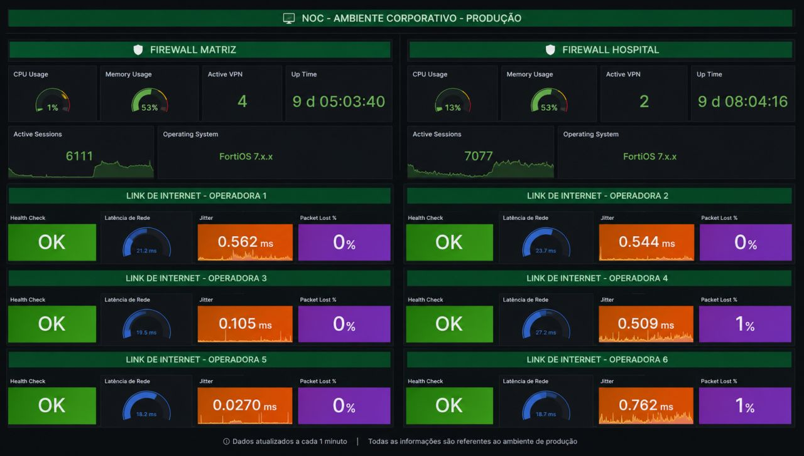

# 🖥 Enterprise NOC Dashboard

Dashboard desenvolvido do zero para monitoramento de infraestrutura corporativa utilizando **Grafana** e **Zabbix**.

---

## 📌 Visão Geral

Este dashboard centraliza os principais indicadores de infraestrutura em uma única tela, permitindo identificar rapidamente falhas, indisponibilidades e degradação de desempenho.

## 📊 Recursos

- ✅ Status dos dispositivos
- ✅ Disponibilidade
- ✅ Latência
- ✅ Jitter
- ✅ Perda de Pacotes
- ✅ Firewalls FortiGate
- ✅ Links de Internet
- ✅ VPN
- ✅ CPU e Memória

## 🛠 Tecnologias

- Grafana
- Zabbix
- FortiGate
- SNMP
- ICMP

## 📦 Compatibilidade

| Tecnologia | Versão |
|------------|---------|
| Grafana | 10+ |
| Zabbix | 7.x |
| FortiGate | SNMP |

## 📄 Observações

Este projeto foi desenvolvido para fins de estudo e demonstração de conhecimentos em monitoramento de infraestrutura.

Todas as informações apresentadas foram anonimizadas.

## 👨‍💻 Autor

**Maicon Viola Viero**

Analista de Infraestrutura